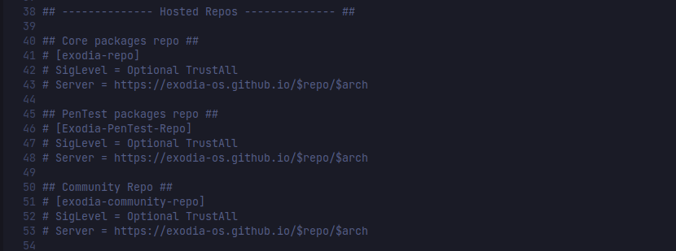
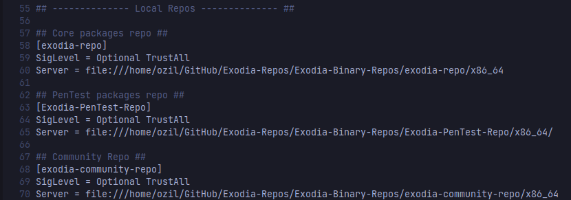

# exodia-ISO
Home Edition source ISO

> **_NOTE:_** 
> 
> **if you want to build this ISO you have to build it on an Arch/Arch-based distro.
> as many users have tried to build the ISO on non-arch-based distros and run into issues.**

### before building:-

- #### install [**`archiso`**](https://wiki.archlinux.org/title/archiso)
    - ##### `sudo pacman -S archiso`

- #### download [eDEX-UI](https://github.com/GitSquared/edex-ui/releases)
    - ##### copy [**`eDEX-UI-Linux-x86_64.AppImage`**](https://github.com/GitSquared/edex-ui/releases) to `src/airootfs/usr/local/bin/`

- #### Use the hosted Repos
    - ##### uncommented these lines
     
    - ##### then, commented these lines
     

# building

```bash

mkdir {work,out} 

sudo mkarchiso -v -w work -o out src 

```

# Contributing

- fork 
- create a new branch with `dev-${GITHUB-USERNAME}` name (e.g. `dev-mmsaeed509`)
  - ```bash
    git checkout -b dev-mmsaeed509
    ```
- commit your changes
  - ```bash
    ./git-push.sh -m "your commit msg"
    ```
- create a pull request